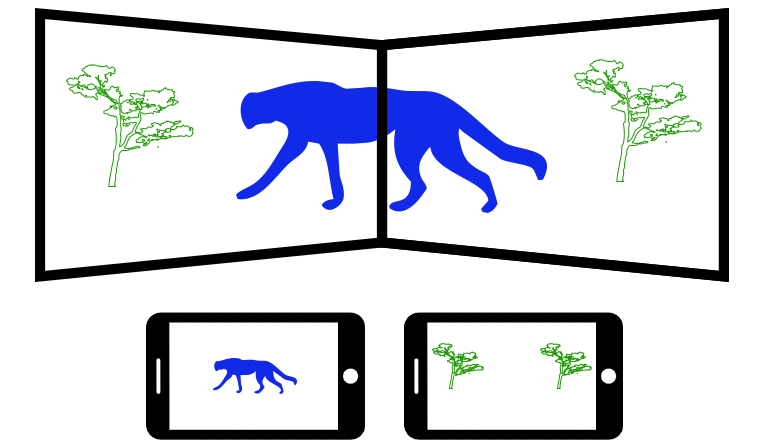
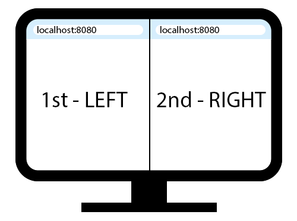

# ✏️ Draw  with friends

Draw with Friends is an app that allows everyone to share their ideas, draw and have fun. For this, a main screen is used and each person through their cell phone can draw something on it.

<p align="center">
  
</p>

## ✔️ Prerequisites
Draw with Friends requires [Node.js](https://nodejs.org/) v14+ to run. Check the version using the command:
```
node -v
```
The output should be something like `v14.17.5`

## 💻 Running the project
1 - Clone this repository to your preferred location with the command:
```
git clone https://github.com/VitorSilvaBueno/drawing-with-friends.git
```
2 - Select drawing-with-friends folder, install the dependencies and start the server.
```sh
cd drawing-with-friends
npm install 
node app.js
```
3 - Open your browser and place the first tab you opened on your left on the screen, and the other tab on your right on the screen. Type `http://localhost:8080/` first in the tab on your left and then in the tab on your right.

⚠️It's important to follow the opening sequence of the tabs indicated, because socket.io will use an array that stores the connections id to know which is the screen on the right and which is the screen on the left.

<p align="center">
  
</p>

4 - And to start drawing open `http://localhost:8080/controller.html` in your browser.